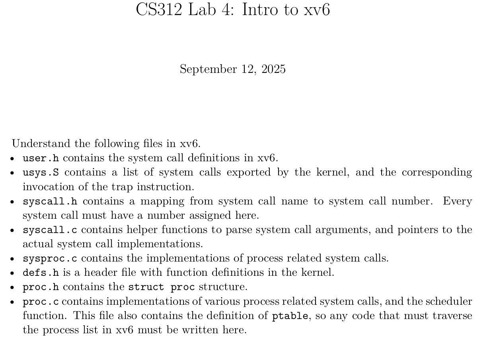

# cs312

Operating Systems

## Notes

### Lab 1

EOF signal is indicated by Ctrl+D. Alternatively, use an input file or piping using bash.

```
./charcount < somefile.txt
```

```
cat somefile.txt | ./charcount
```

Remember to compile with -lm flag to include math library

```bash
gcc printlog.c -o printlog -lm
```

### Lab 2

Header file stack.h gives the definition of the ADT.

These commands produce .o object files.

```bash
gcc -c arrstack.c
gcc -c llstack.c
```

To build the program:

```bash
gcc -o stackmain stackmain.c arrstack.o -DARRAY_STACK
gcc -o stackmain stackmain.c llstack.o
```

### Lab 3

ps command to look up info about a process, given it's name:

```bash
ps aux | grep "hello"
satyam    474098  0.0  0.0   2684  1408 pts/3    S+   10:15   0:00 ./hello
satyam    474267  0.0  0.0   9148  2176 pts/4    S+   10:16   0:00 grep --color=auto hello
```

ps command to show parent pid, command, and memory being used (RSS = Resident Set Size (KB)) :

```bash
ps -o pid,ppid,comm,rss 474098
    PID    PPID COMMAND           RSS
 474098   44351 hello            1408
```

The memory usage of the program will change if a large array is being accessed, not just with initialization.

The 0,1, and 2 files in the /proc/{pid}/fd directory are symbolic links to the stdin, stdout, stderr respectively.
The output file here won't be affected if we redirect the output of the program to a local file through the shell.

/proc/{pid}/fd/2 is still written to, but it doesn’t point to the terminal anymore — it points to the file you redirected into.

If you don’t redirect, /proc/{pid}/fd/2 continues to point to your tty device (e.g., /dev/pts/3).

```bash
(base) satyam@A514-56GM:/proc/485987/fd$ ls -l
total 0
lrwx------ 1 satyam satyam 64 Sep 18 10:37 0 -> /dev/pts/3
l-wx------ 1 satyam satyam 64 Sep 18 10:37 1 -> /home/satyam/Dev/cs312/Lab3/code/error.log
lr-x------ 1 satyam satyam 64 Sep 18 10:37 103 -> /usr/share/code/v8_context_snapshot.bin
lrwx------ 1 satyam satyam 64 Sep 18 10:37 2 -> /dev/pts/3
l-wx------ 1 satyam satyam 64 Sep 18 10:37 37 -> /home/satyam/.config/Code/logs/20250917T134331/ptyhost.log
lrwx------ 1 satyam satyam 64 Sep 18 10:37 38 -> /dev/ptmx
lrwx------ 1 satyam satyam 64 Sep 18 10:37 39 -> /dev/ptmx
lrwx------ 1 satyam satyam 64 Sep 18 10:37 40 -> /dev/ptmx
```

### Lab 4



```bash
make clean && make && make qemu-nox
```

To implement a new system call (simple ones like hello):

- Update user.h
- Update usys.S
- Update syscall.h
- Update syscall.c
- Implement the function in sysproc.c

Use cprintf to print to the console (in sysproc.c).

```c
cprintf("Hello, %s!\n", s);
```

Why no stdio.h in xv6 kernel code?

    stdio.h (and functions like printf) are part of the C standard library (glibc, musl, etc.).

    That library depends on system calls provided by an operating system (like Linux or Windows).

    But in the kernel itself (like xv6’s kernel), there is no libc — the kernel is the lowest layer.
    → So the kernel cannot use printf

In user programs in xv6

    User programs (those you write in user/) do have a small printf implementation.

    It’s a tiny, xv6-specific version, not full libc printf.

    Defined in user/ulib.c and user/printf.c.

    This user-level printf makes a write system call to print to file descriptors (e.g., fd = 1 for stdout).

To implement a new system call (dealing with processes):

- Update user.h
- Update usys.S
- Update syscall.h
- Update syscall.c
- Update sysproc.c with a dummy function
- Implement the function in proc.c

```c
int
getNumProc(void)
{
  int count = 0;
  struct proc *p;

  acquire(&ptable.lock);
  for(p = ptable.proc; p < &ptable.proc[NPROC]; p++){
    if(p->state != UNUSED)
      count++;
  }
  release(&ptable.lock);

  return count;
}
```

- Update defs.h
